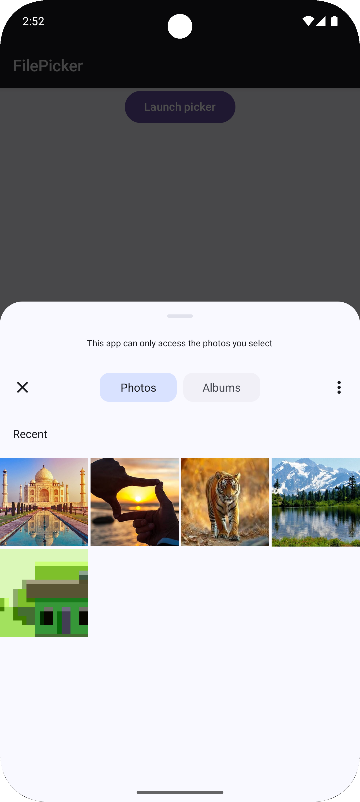
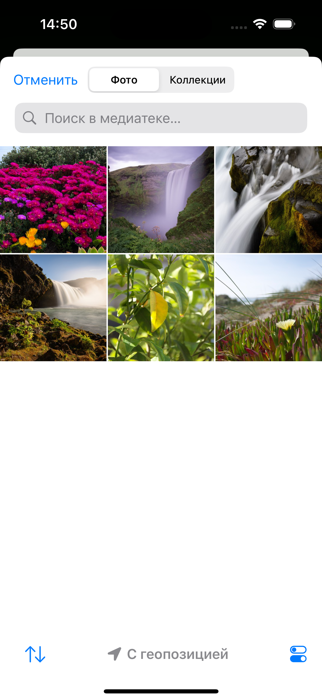

FilePicker is a kotlin multiplatform library for file picking on android and iOS.
Under the hood the library uses LauncherForActivityResult with PickVisualMedia contract on Android and PHPickerViewController on iOS.

## Preview

 

## Overview
Here are some key concepts of the library.

* [KPickedFile](../file-picker/src/commonMain/kotlin/io/github/dimaklekchyan/filepicker/KFilePickerController.kt) - represents an image or video class with file and preview properties

## Installation

project **build.gradle.kts**
```kotlin
kotlin {
    sourceSets {
        commonMain.dependencies {
            implementation("io.github.dimaklekchyan:file-picker:0.1.0")
        }
    }
}
```

## Usage
Common code:
```kotlin
@Composable
fun Sample() {
    val singleImageController = rememberSingleImagePickerController(
        onPreparing = {
            //Image preparing has been started
        },
        onDone = { image ->
            //KPickedFile.Image has been picked successfully
        },
        onException = { 
            //Exception has been occurred
        }
    )
    val multipleVideosController = rememberMultipleVideosPickerController(
        maxItems = 4, 
        onPreparing = {
            //Videos preparing has been started
        },
        onDone = { videos ->
            //List<KPickedFile.Video> has been picked successfully
        },
        onException = {
            //Exception has been occurred
        }
    )
    
    //...
    singleImageController.launch()
    multipleVideosController.launch()
    //...
}
```

Set `persistFile = true` to get a persistent URI on Android and a bookmarks file on iOS to be able to use the URI after process restart.

```kotlin
@Composable
fun Sample() {
    val controller = rememberSingleImagePickerController(
        persistFile = true,
        onDone = {  }
    )
}
```

## Samples
More examples can be found in the [sample directory](../sample/shared/src/commonMain/kotlin/io/github/dimaklekchyan/sample/shared/Sample.kt).

